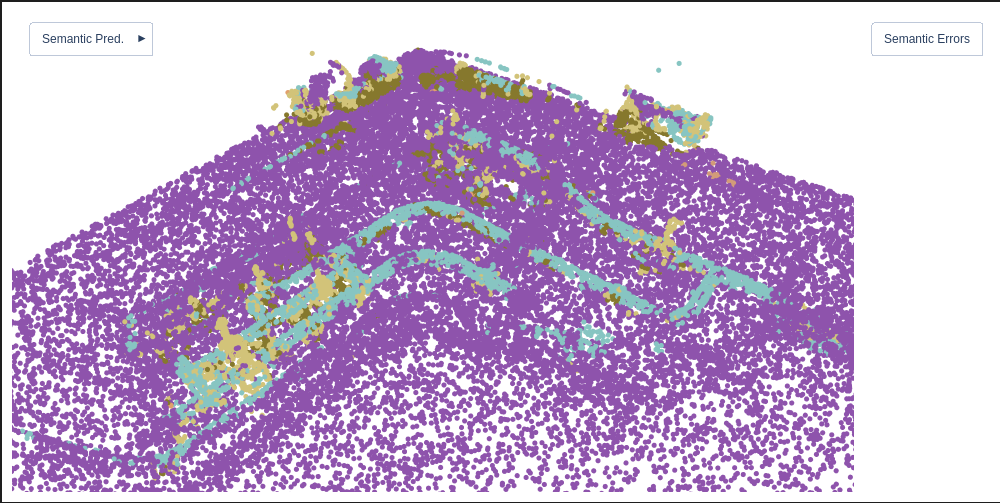

= Training vom 30. Juni 2025

[NOTE]
|===
| GPU | RTX 5060 Ti
| Config | 11g
| Id | Kitti360 mapping
| `xy_tiling` | 5
| `sample_graph_k` | 2
| Epochs | 100
| Checkpoint | `0630_training_1_synthetic_11g_epoch_099.ckpt`
| Dataset (Seeds) | 10-34
|===

.Prediction für Ontras_2

== Ergebnisse

Rohre (4) und Armaturen (5) wurden relativ gut segmentiert in Kontext des ersten Trainings ohne vortrainiertes Modell.

.level ratios
====
'|P_0| / |P_1|': 22.907525347735262 +
'|P_1| / |P_2|': 6.199305116866709 +
'|P_2| / |P_3|': 8.968838526912181
====

|===
|                   epoch | 100
|            lr-AdamW/pg1 | 0.0
|   lr-AdamW/pg1-momentum | 0.9
|            lr-AdamW/pg2 | 0.0
|   lr-AdamW/pg2-momentum | 0.9
|            test/iou_car | 7.0746
|          test/iou_fence | 47.2015
|     test/iou_motorcycle | 0.13364
|           test/iou_pole | 31.00544
|        test/iou_terrain | 48.86316
|     test/iou_vegetation | 0.56549
|               test/loss | 22.30112
|               test/macc | 46.01691
|               test/miou | 22.47397
|                 test/oa | 49.7406
|      train/iou_building | 0.0
|           train/iou_car | 49.03964
|         train/iou_fence | 93.73946
|    train/iou_motorcycle | 39.43418
|         train/iou_other | 0.0
|          train/iou_pole | 84.4621
|          train/iou_road | 0.0
|      train/iou_sidewalk | 0.0
|           train/iou_sky | 0.0
|       train/iou_terrain | 99.98667
| train/iou_traffic light | 0.0
|  train/iou_traffic sign | 0.0
|         train/iou_truck | 0.0
|    train/iou_vegetation | 95.13011
|          train/iou_wall | 0.0
|              train/loss | 0.02787
|              train/macc | 89.58147
|              train/miou | 76.96536
|                train/oa | 99.76083
|     trainer/global_step | 30000
|             val/iou_car | 48.84169
|           val/iou_fence | 94.32039
|      val/iou_motorcycle | 34.50135
|            val/iou_pole | 84.37553
|            val/iou_road | 0.0
|         val/iou_terrain | 99.98355
|   val/iou_traffic light | 0.0
|           val/iou_truck | 0.0
|      val/iou_vegetation | 96.72884
|                val/loss | 0.05594
|                val/macc | 85.1158
|           val/macc_best | 86.37265
|                val/miou | 76.45856
|           val/miou_best | 76.45856
|                  val/oa | 99.75065
|             val/oa_best | 99.75065
|===