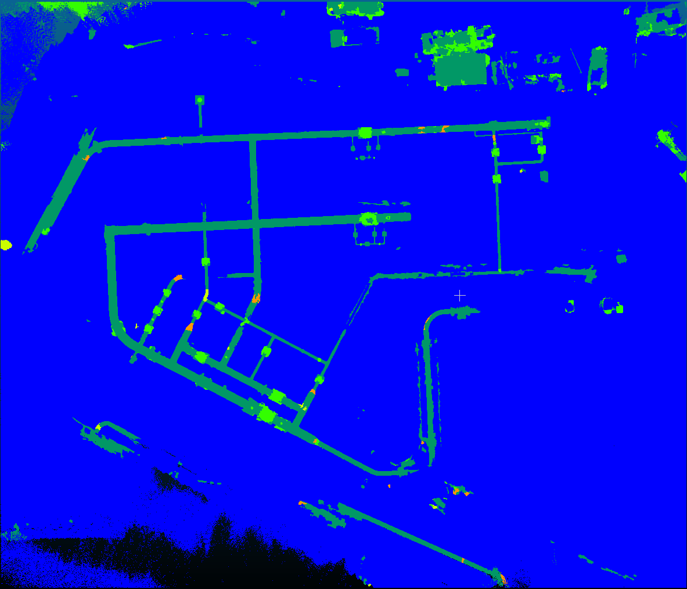

= Training vom 01. Juli 2025

== Training 1
[NOTE]
|===
| GPU | RTX 5060 Ti
| Config | 11g
| Id | Synthetic mapping
| `xy_tiling` | 2
| `sample_graph_k` | 4
| Epochs | 100
| Checkpoint | `0701_training_1_synthetic_11g_epoch_029.ckpt`
| Dataset (Seeds) | 10-34
|===

=== Ergebnisse

Alles wird als Ground erkannt ohne Ausnahme.

.level ratios
====
'|P_0| / |P_1|': 22.90285772502674 +
'|P_1| / |P_2|': 6.146211646837821 +
'|P_2| / |P_3|': 9.0997150997151
====

|===
|                epoch | 100
|         lr-AdamW/pg1 | 0.0
|lr-AdamW/pg1-momentum | 0.9
|         lr-AdamW/pg2 | 0.0
|lr-AdamW/pg2-momentum | 0.9
|      test/iou_ground | 100
|            test/loss | 1e-05
|            test/macc | 100
|            test/miou | 100
|              test/oa | 100
|    train/iou_adapter | 0.0
|   train/iou_armature | 0.0
|     train/iou_corner | 0.0
|     train/iou_ground | 100
|       train/iou_pipe | 0.0
|           train/loss | 0.0
|           train/macc | 100
|           train/miou | 100
|             train/oa | 100.00001
|  trainer/global_step | 4800
|      val/iou_adapter | 0.0
|       val/iou_corner | 0.0
|       val/iou_ground | 100
|         val/iou_pipe | 0.0
|             val/loss | 0.0
|             val/macc | 100
|        val/macc_best | 100
|             val/miou | 100
|        val/miou_best | 100
|               val/oa | 99.99999
|          val/oa_best | 99.99999
|===

== Training 2
[NOTE]
|===
| GPU | RTX 5060 Ti
| Config | 11g
| Id | Synthetic mapping
| `xy_tiling` | 5
| `sample_graph_k` | 2
| Epochs | 100
| Checkpoint | `0701_training_2_synthetic_11g_epoch_099.ckpt`
| Dataset (Seeds) | 10-34
|===

=== Ergebnisse

Bestes Ergebnis bisher. 
Pipe wird sehr gut erkannt, aber Corner und Adapter werden nicht erkannt.
Trotzdem viele falsch positive Pipes und Armatures.

|===
|                 epoch | 100
|          lr-AdamW/pg1 | 0.0
| lr-AdamW/pg1-momentum | 0.9
|          lr-AdamW/pg2 | 0.0
| lr-AdamW/pg2-momentum | 0.9
|      test/iou_adapter | 0.15479
|     test/iou_armature | 28.4379
|       test/iou_corner | 9.03692
|       test/iou_ground | 64.58376
|         test/iou_pipe | 46.01279
|             test/loss | 247.05611
|             test/macc | 55.84
|             test/miou | 29.64523
|               test/oa | 65.07621
|     train/iou_adapter | 48.88235
|    train/iou_armature | 87.09328
|      train/iou_corner | 55.43763
|      train/iou_ground | 99.99397
|        train/iou_pipe | 94.45477
|            train/loss | 0.06128
|            train/macc | 89.76737
|            train/miou | 77.1724
|              train/oa | 99.81074
|   trainer/global_step | 30000
|       val/iou_adapter | 45.09308
|      val/iou_armature | 86.75053
|        val/iou_corner | 57.02246
|        val/iou_ground | 99.98611
|          val/iou_pipe | 94.83588
|              val/loss | 0.09335
|              val/macc | 88.32904
|         val/macc_best | 88.33389
|              val/miou | 76.73761
|         val/miou_best | 76.73761
|                val/oa | 99.78522
|           val/oa_best | 99.78522
|===