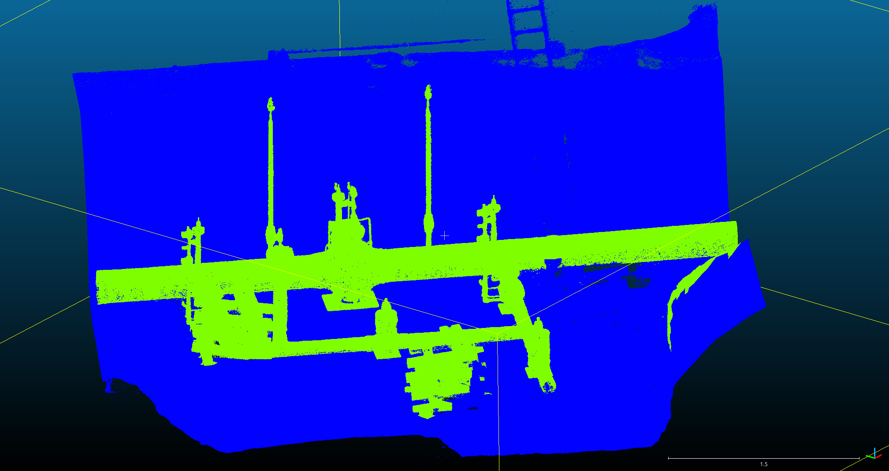
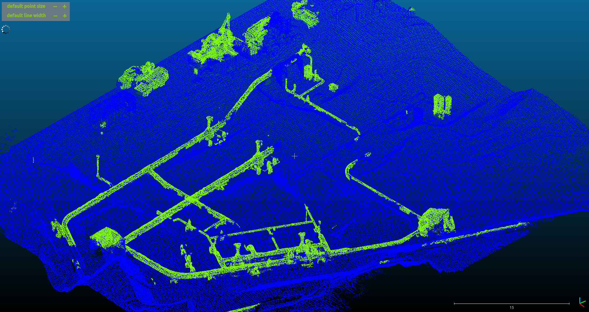

= Training vom 07. Juli 2025

== Training 1
[NOTE]
|===
| GPU | RTX 5060 Ti
| Config | 11g
| Id | Synthetic mapping
| `xy_tiling` | 5
| `sample_graph_k` | 2
| Epochs | 100
| Checkpoint | `0709_training_1_synthetic_11g_epoch_049.ckpt`
| Dataset (Seeds) | 10-64, 100-110
|===

.Anmerkungen
----
Bei diesem Training wurden die Klassen Armature(2), Corner(3) und Adapter(4) auf die Klasse Pipe(1) gemapped.
----

=== Ergebnisse

Auf Ontras_1 ist die Segmentierung nahezu perfekt. Ontras_3 hat Probleme an stellen an denen die Rohr Geometrie Artefaktbehaftet ist. Zb wurde beim Scan der Boden unter den Pipes teils nicht richtig erfasst sodass eine planare fläche tangential zum Rohr nach unten geht.

.Prediction für Ontras_1

.Prediction für Ontras_3

|===
|                epoch | 99
|         lr-AdamW/pg1 | 0.0
|lr-AdamW/pg1-momentum | 0.9
|         lr-AdamW/pg2 | 0.0
|lr-AdamW/pg2-momentum | 0.9
|     train/iou_ground | 97.92084
|       train/iou_pipe | 69.91153
|           train/loss | 2.03155
|           train/macc | 87.08824
|           train/miou | 83.91618
|             train/oa | 98.01666
|  trainer/global_step | 64999
|       val/iou_ground | 99.89364
|         val/iou_pipe | 97.7612
|             val/loss | 0.81661
|             val/macc | 99.57477
|        val/macc_best | 99.87415
|             val/miou | 98.82742
|        val/miou_best | 99.33021
|               val/oa | 99.89838
|          val/oa_best | 99.9427
|===
