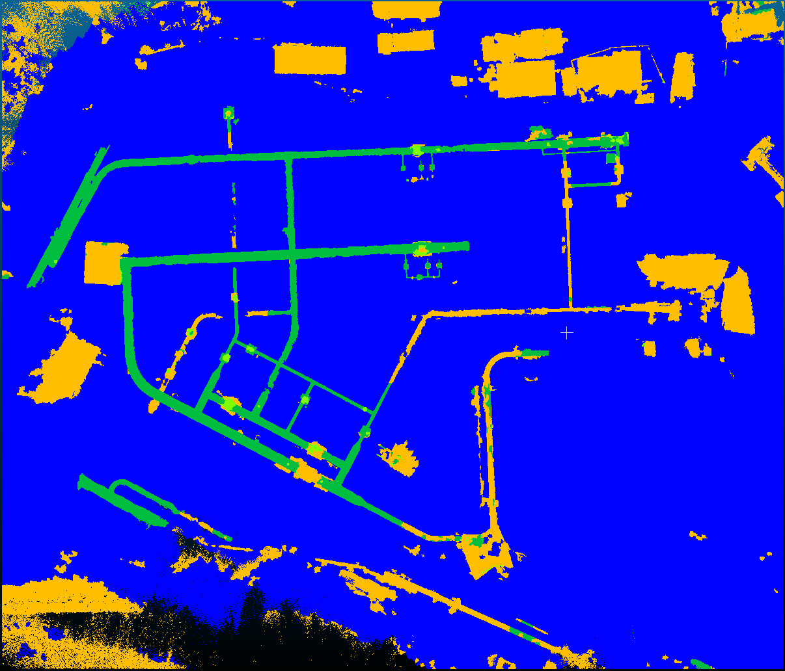

= Training vom 29. Juli 2025

== Training 1
[NOTE]
|===
| GPU | RTX 5060 Ti
| Config | 11g
| Id | Synthetic mapping
| `xy_tiling` | 5
| `sample_graph_k` | 2
| Epochs | 25
| Checkpoint | `0729_training_1_synthetic_11g_epoch_009.ckpt`
| Dataset (Seeds) | 0200 - 0299
|===

.Anmerkungen
****
Dieses Training wurde auf einem neuen angepassten Datensatz (v2) durchgeführt:

* Es wurde nachträglich die Farben der Rohre geändert (pipe, armature, corner, adapter, armatureDecoy).
* Der train und val Datensatz wurde jeweils gedrittelt
** erster Teil: ist so geblieben wie er ist
** zweiter Teil: die Farben der Rohre wurden geändert basierend auf der orginalen Farbe, sodass jedes Teilstück eine andere Farbe hat
** dritter Teil: die Farben der Rohre wurden komplett auf eine Farbe geändert für jeweils eine Punktwolke
* Das Training wurde mit ONLY_PIPE gestartet, jedoch mit Armaturen: [0, 1, 2] (backgrond-Objekte sind 3).
****

=== Ergebnisse

* `pre_transform` in 20m
* `train` in 1h

|===
|                 epoch | 24
|          lr-AdamW/pg1 | 0.00096
| lr-AdamW/pg1-momentum | 0.9
|          lr-AdamW/pg2 | 0.0001
| lr-AdamW/pg2-momentum | 0.9
|    train/iou_armature | 83.17429
|      train/iou_ground | 99.92436
|        train/iou_pipe | 97.73441
|            train/loss | 0.04
|            train/macc | 97.91189
|            train/miou | 93.61102
|              train/oa | 99.89257
|   trainer/global_step | 24999
|      val/iou_armature | 76.83142
|        val/iou_ground | 99.85183
|          val/iou_pipe | 96.26538
|              val/loss | 0.07462
|              val/macc | 96.90067
|         val/macc_best | 96.90067
|              val/miou | 90.98288
|         val/miou_best | 94.13026
|                val/oa | 99.81388
|           val/oa_best | 99.9018
|===

== Training 2
[NOTE]
|===
| GPU | RTX 5060 Ti
| Config | 11g
| Id | Synthetic mapping
| `xy_tiling` | 5
| `sample_graph_k` | 2
| Epochs | 25
| Checkpoint | `0729_training_2_synthetic_11g_epoch_009.ckpt`
| Dataset (Seeds) | 0200 - 0299
|===

.Anmerkungen
****
* Ich habe in die synthetic.yaml wieder `xy_tiling` gesetzt, um zu testen ob es einen Unterschied macht.
****

=== Ergebnisse

* Es scheint einen Unterschied zu machen ob man die gesammte Punktwolke predicted oder die Tiles.
* Tiles scheinen besser zu funktionieren vermutlich da sie näher an den Trainingsdaten sind.
* Das ist insofern interessant, als die Autoren meinen das man die Wolke auch direkt komplett predicten kann.

|===
|                 epoch | 24
|          lr-AdamW/pg1 | 0.00096
| lr-AdamW/pg1-momentum | 0.9
|          lr-AdamW/pg2 | 0.0001
| lr-AdamW/pg2-momentum | 0.9
|    train/iou_armature | 81.91554
|      train/iou_ground | 99.90612
|        train/iou_pipe | 97.45637
|            train/loss | 0.04114
|            train/macc | 97.62842
|            train/miou | 93.09267
|              train/oa | 99.8764
|   trainer/global_step | 24999
|      val/iou_armature | 69.77847
|        val/iou_ground | 99.65421
|          val/iou_pipe | 93.0679
|              val/loss | 0.06186
|              val/macc | 96.79858
|         val/macc_best | 98.36394
|              val/miou | 87.50019
|         val/miou_best | 91.88422
|                val/oa | 99.62862
|           val/oa_best | 99.87566
|===

== Training 3
[NOTE]
|===
| GPU | RTX 5060 Ti
| Config | 11g
| Id | Synthetic mapping
| `xy_tiling` | 5
| `sample_graph_k` | 2
| Epochs | 25
| Checkpoint | `0729_training_3_synthetic_11g_epoch_009.ckpt`
| Dataset (Seeds) | 0200 - 0299
|===

.Anmerkungen
****
* Die Background-Klasse wurde als echte Klasse hinzugefügt sodass sie mit predicted wird.
****

=== Ergebnisse

* Kaum Verbesserungen
* Tiling hilft aber etwas beim predicten
* Die Background-Klasse ist jedoch sehr dominant geworden

|===
|                     epoch | 24
|              lr-AdamW/pg1 | 0.00096
|     lr-AdamW/pg1-momentum | 0.9
|              lr-AdamW/pg2 | 0.0001
|     lr-AdamW/pg2-momentum | 0.9
|        train/iou_armature | 85.69829
| train/iou_backgroundother | 96.72928
|          train/iou_ground | 99.64986
|            train/iou_pipe | 98.11276
|                train/loss | 0.06685
|                train/macc | 98.13765
|                train/miou | 95.04755
|                  train/oa | 99.66042
|       trainer/global_step | 24999
|          val/iou_armature | 73.03063
|   val/iou_backgroundother | 94.42211
|            val/iou_ground | 99.4086
|              val/iou_pipe | 96.72779
|                  val/loss | 0.31503
|                  val/macc | 96.81943
|             val/macc_best | 97.54874
|                  val/miou | 90.89728
|             val/miou_best | 92.60218
|                    val/oa | 99.40652
|               val/oa_best | 99.57302
|===