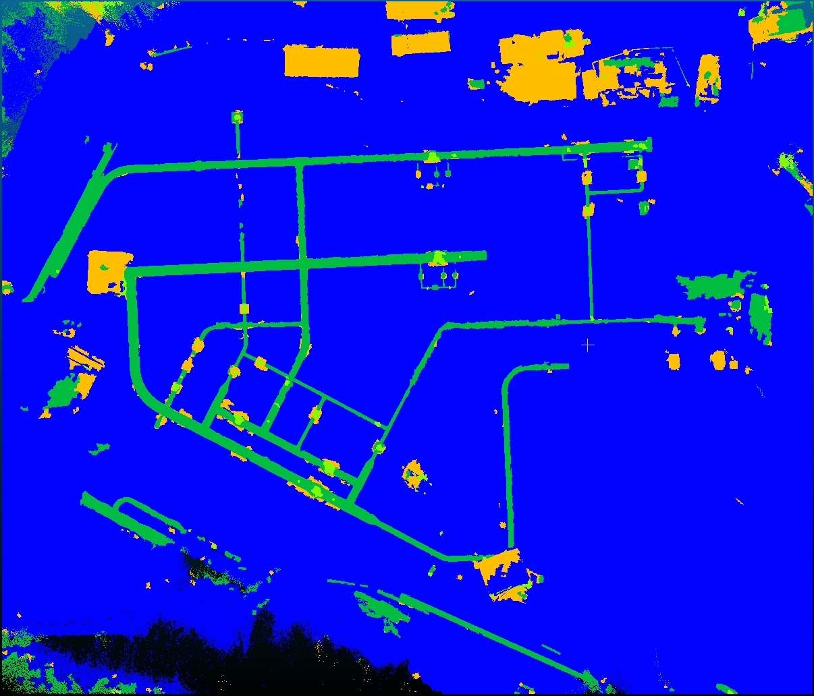
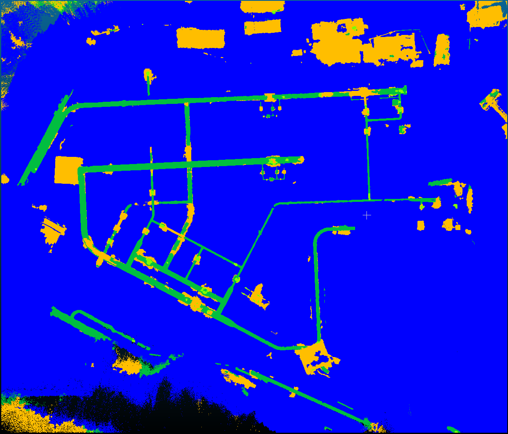

= Training vom 18. August 2025

== Training 1
[NOTE]
|===
| GPU | RTX 5060 Ti
| Config | 11g
| Id | Synthetic mapping
| `xy_tiling` | 5
| `sample_graph_k` | 2
| Epochs | 20
| Checkpoint | `0818_training_1_synthetic_11g_epoch_019.ckpt`
| Dataset (Seeds) | 0300 - 0399
|===

.Anmerkungen
****
Dieses Training wurde auf einem neuen angepassten Datensatz (v3) durchgeführt:

* Die Farbanpassungen welche beim vorherigen Training Ende Juli gemacht wurden, sind nun im Datensatz automatisch enthalten. Sie sind codierte im seed: seed%3=0,1,2
** 0: rohrfarben im testdatensatz
** 1: zufällige farben für jedes rohrsegment
** 2: zufällige farbe für das gesammte pipesystem
* Rohre und Armaturen haben nun Dellen und Unregelmäßigkeiten mittels 3d-Noise-Funktion
* Neue Armature-Type: Uneven Armature (auch mit 3d-Noise-Funktion)
* Neue Hintergrundklasse: Random Points in Boundingbox
* Zweites Leitungssystem welches oberirdisch ist und mit den DecoyObjects kollidieren kann
* Das Pipe-Artifact wurde verbessert, es folgt nun einer Kurve (polynomielle Funktion) für einen sauberen Übergang
****

=== Ergebnisse

* `pre_transform` in 30m
* `train` in 50m

|===
|                 epoch | 19
|          lr-AdamW/pg1 | 0.00994
| lr-AdamW/pg1-momentum | 0.9
|          lr-AdamW/pg2 | 0.00099
| lr-AdamW/pg2-momentum | 0.9
|    train/iou_armature | 68.88668
|  train/iou_background | 92.07413
|      train/iou_ground | 99.19945
|        train/iou_pipe | 92.7448
|            train/loss | 0.29965
|            train/macc | 94.5958
|            train/miou | 88.22626
|              train/oa | 99.02969
|   trainer/global_step | 19999
|      val/iou_armature | 72.16955
|    val/iou_background | 94.45492
|        val/iou_ground | 99.3777
|          val/iou_pipe | 95.04818
|              val/loss | 0.23289
|              val/macc | 96.51996
|         val/macc_best | 96.51996
|              val/miou | 90.26259
|         val/miou_best | 90.26259
|                val/oa | 99.25159
|           val/oa_best | 99.25159
|===

== Training 2
[NOTE]
|===
| GPU | RTX 5060 Ti
| Config | 11g
| Id | Synthetic mapping
| `xy_tiling` | 5
| `sample_graph_k` | 2
| Epochs | 30
| Checkpoint | `0818_training_2_synthetic_11g_epoch_029.ckpt`
| Dataset (Seeds) | 0300 - 0399
|===

.Anmerkungen
****
Es wurde 30 statt 20 Epochen trainiert.
Dies hat die Ergebnisse verbessert, es ist ein noch längeres Training sinnvoll.
Es wäre sogar denkbar noch mehr Daten zu generieren.
****

=== Ergebnisse

* `train` in 1h15m

|===
|                 epoch | 29
|          lr-AdamW/pg1 | 0.00025
| lr-AdamW/pg1-momentum | 0.9
|          lr-AdamW/pg2 | 3e-05
| lr-AdamW/pg2-momentum | 0.9
|    train/iou_armature | 79.62875
|  train/iou_background | 95.83474
|      train/iou_ground | 99.394
|        train/iou_pipe | 94.535
|            train/loss | 0.18828
|            train/macc | 96.40909
|            train/miou | 92.34812
|              train/oa | 99.33931
|   trainer/global_step | 29999
|      val/iou_armature | 80.62175
|    val/iou_background | 96.18229
|        val/iou_ground | 99.50295
|          val/iou_pipe | 96.30318
|              val/loss | 0.15339
|              val/macc | 97.24865
|         val/macc_best | 97.24865
|              val/miou | 93.15254
|         val/miou_best | 93.15254
|                val/oa | 99.44969
|           val/oa_best | 99.44969
|===