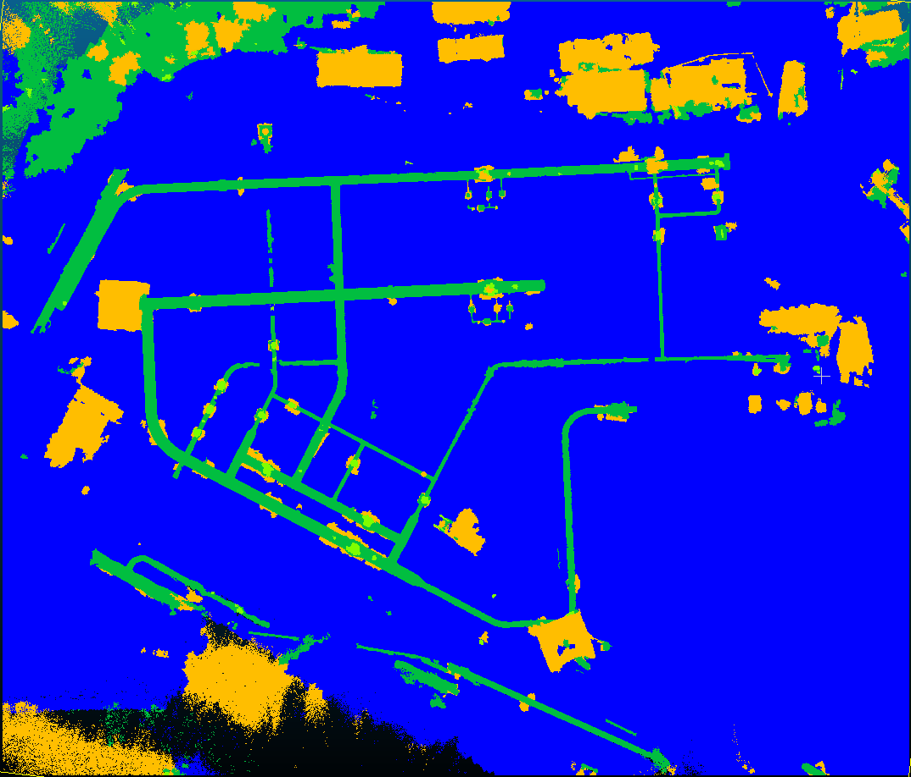

= Training vom 27. August 2025

== Training 1
[NOTE]
|===
| GPU | RTX 5060 Ti
| Config | 11g
| Id | Synthetic mapping
| `xy_tiling` | 5
| `sample_graph_k` | 2
| Epochs | 70
| Checkpoint | `0827_training_1_synthetic_11g_epoch_069.ckpt`
| Dataset (Seeds) | 0500 - 0599
|===

.Anmerkungen
****
Dieses Training wurde auf einem neuen angepassten Datensatz (v5) durchgeführt:

* Die Erstellung der Landscape geschieht nun über die Geometry-Nodes
* Die Rohrhöhen sind nun zufällig
* Der Scan läuft nicht mehr aus allen 5 Richtungen, sondern nur einer Teilmenge dieser.
****

=== Ergebnisse

* `train` in 1h50m

Pipes werden nochmal ein Stück zuverlässiger Erkannte.
Bei Armaturen werden jetzt fast alle erkannt.
Jedoch gibt es eine größere Bodenfläche am Rand in Ontras_3 der als Pipe erkannt wird und die false-positives erhöht. 

|===
|                 epoch | 69
|          lr-AdamW/pg1 | 1e-05
| lr-AdamW/pg1-momentum | 0.9
|          lr-AdamW/pg2 | 0.0
| lr-AdamW/pg2-momentum | 0.9
|    train/iou_armature | 83.96225
|  train/iou_background | 96.31528
|      train/iou_ground | 99.50986
|        train/iou_pipe | 94.63879
|            train/loss | 0.18788
|            train/macc | 96.65291
|            train/miou | 93.60654
|              train/oa | 99.43459
|   trainer/global_step | 69999
|      val/iou_armature | 82.72441
|    val/iou_background | 96.07891
|        val/iou_ground | 99.42268
|          val/iou_pipe | 93.23408
|              val/loss | 0.20163
|              val/macc | 96.33214
|         val/macc_best | 96.33214
|              val/miou | 92.86502
|         val/miou_best | 92.86502
|                val/oa | 99.35363
|           val/oa_best | 99.35363
|===

