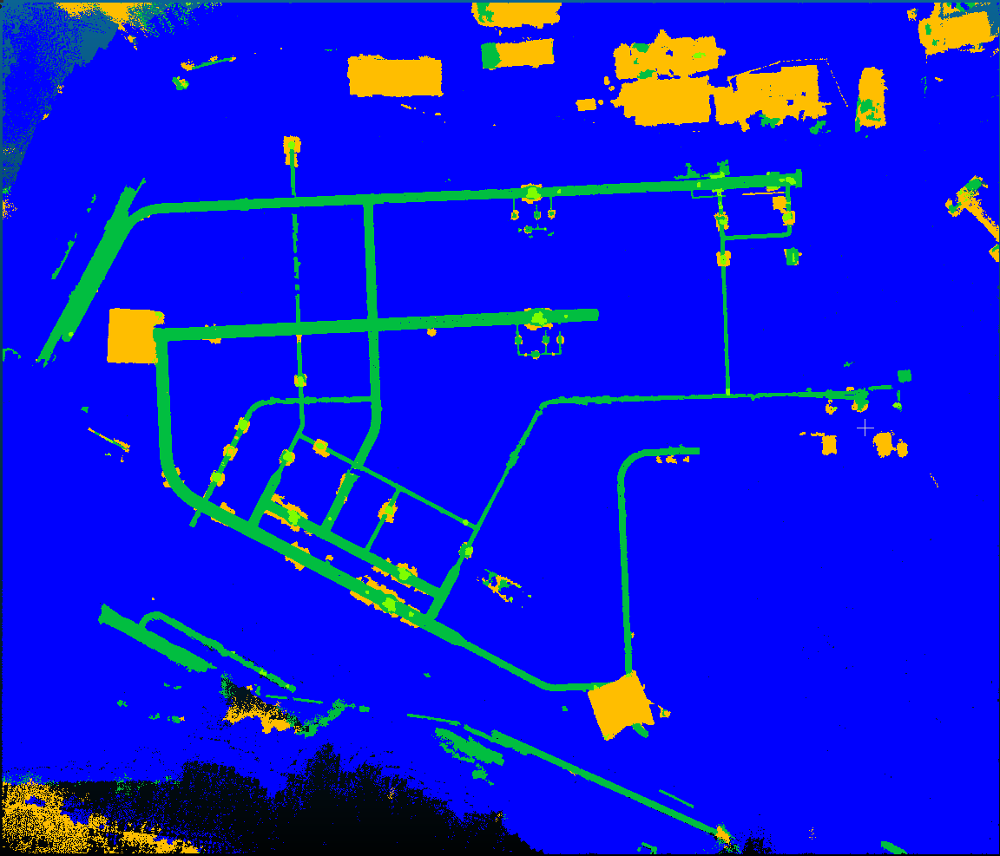

= Training vom 04. September 2025

== Training 1
[NOTE]
|===
| GPU | RTX 5060 Ti
| Config | 11g
| Id | Synthetic mapping
| `xy_tiling` | 5
| `sample_graph_k` | 2
| Epochs | 70
| Checkpoint | `0904_training_1_synthetic_11g_epoch_069.ckpt`
| Dataset (Seeds) | 0700 - 0799
|===

.Anmerkungen
****
Dieses Training wurde auf einem neuen angepassten Datensatz (v7) durchgeführt:

* uneven decoy armatures
* mehr und zufällige boden elevation
* zwei farbige Böden
* größere und dickere Blätter
****

=== Ergebnisse

* `pre_transform` in 20m
* `train` in 2h50m

Die bislang besten Ergebnisse.
Die Bodenfläche die letztes Mal fälschlicherweise als Pipe erkannt wurde, ist nun kein Problem mehr.
Aber die verbesserte Erkennungsrate der Rohre ist gleich geblieben.
Die Precision der Armaturen hat sich verschlechtert.

|===
|                 epoch | 69
|          lr-AdamW/pg1 | 1e-05
| lr-AdamW/pg1-momentum | 0.9
|          lr-AdamW/pg2 | 0.0
| lr-AdamW/pg2-momentum | 0.9
|    train/iou_armature | 84.71076
|  train/iou_background | 96.36259
|      train/iou_ground | 99.29432
|        train/iou_pipe | 95.13398
|            train/loss | 0.25789
|            train/macc | 96.71918
|            train/miou | 93.87541
|              train/oa | 99.23677
|   trainer/global_step | 69999
|      val/iou_armature | 82.49574
|    val/iou_background | 95.56187
|        val/iou_ground | 99.22563
|          val/iou_pipe | 94.60991
|              val/loss | 0.2782
|              val/macc | 96.16801
|         val/macc_best | 96.42848
|              val/miou | 92.97329
|         val/miou_best | 92.97329
|                val/oa | 99.15992
|           val/oa_best | 99.15992
|===

